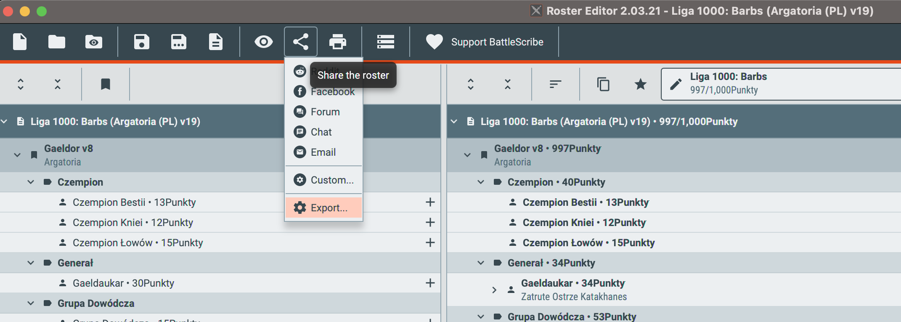
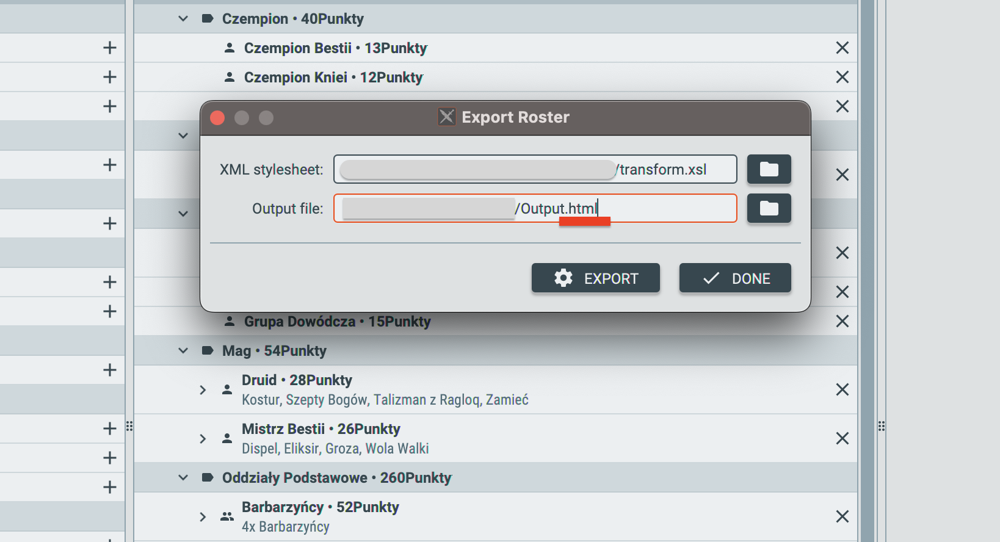

# XSLT (Extensible Stylesheet Language Transformations) styling file for [BattleScribe](https://battlescribe.net/?tab=news) rosters for [the Argatoria](https://www.spellcrow.com/argatoria-c-76.html) wargame

In order to generate and print a styled roster for [the Argatoria](https://www.spellcrow.com/argatoria-c-76.html) wargame:

1. Download the [transform.xsl file](transform.xsl) and save it to a local hard disk on your computer.
1. On top of the [transform.xsl file](transform.xsl) there is a code section with transformation parameters. Parameter _rules_ is responsible for printing the wording of rules. There are 3 possible settings:
    * _names_ - only rules' names are outputted
    * _section_ - rules' names are printed with units' stats and rules' wordings are printed in a separate section
    * _inline_ - rules' names and wordings are printed with units' stats
In order to set the _rules_ parameter, write the selected option between `<xsl:param name="rules">` and `</xsl:param>`.
```
<!-- Transformation params-->

<!--
    Rules' output verbosity level:
    names - output only rules' names
    section - output rules' names within tables and rules' descriptions in seperate section
    inline (default) - output rules' names and descriptions within tables
-->
<xsl:param name="rules">inline</xsl:param>
```
1. Run [BattleScribe](https://battlescribe.net/?tab=news) and open the roster, which you want to print.
1. Click _Share the roster_ button and select _Export..._ 
1. In the _Export Roster_ dialog fill in the following:
    * _XML stylesheet_ with path to downloaded [transform.xsl file](transform.xsl)
    * _Output file_ with path to output roster file for printing. *Remember to add a _.html_ extension to the resulting file!*

    
1. Close [BattleScribe](https://battlescribe.net/?tab=news) and open the _.html_ file from the previous step in a web browser.
1. Print file from a web browser. If your operating system allows it, try printing two pages on one sheet of paper and experiment with page orientation.